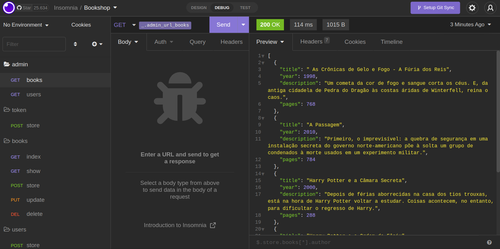

<h1 align="center">Book Shop API 📕</h1>

Projeto referente aos estudos de JavaScript e suas bibliotecas.

---


Cadastre livros na Book Shop API, para consumi-los em seu projeto casual.

---

## 🔧 | Instalação:

Antes de sua utilização é necessário realizar a instalação dos pacote para o funcionamento da API.

**OBS**: Neste projeto foi utilizado o runtime **NodeJS**, antes de realizar os processos de instalação das bibliotecas realize a instalação do NodeJS.

[](https://nodejs.org/en/download/)

## 📦 | Instalação dos pacotes:

```
npm i
```

## 🔰 | Iniciar a API:

```
npm run dev
```

## 📡 | Utilização:

- Para o realizar o CRUD das rotas "users" e "books" é necessário realizar a autenticação via token na rota "token".

## 💡| Recomendações:

- Utilização do **Insomnia** ou **Postman**


_Utilização do Insomnia para a realização das requisições._

## 🔗 | Ferramentas:

[](https://nodejs.org/en/download/)
[](https://sequelize.org/)
[](https://expressjs.com/)
